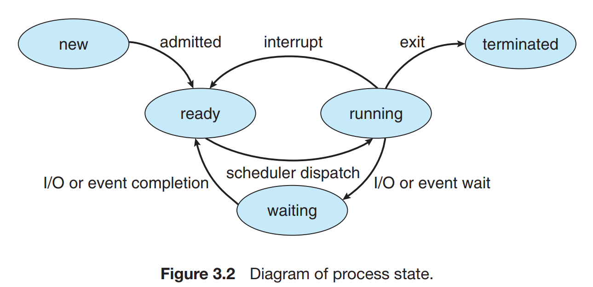
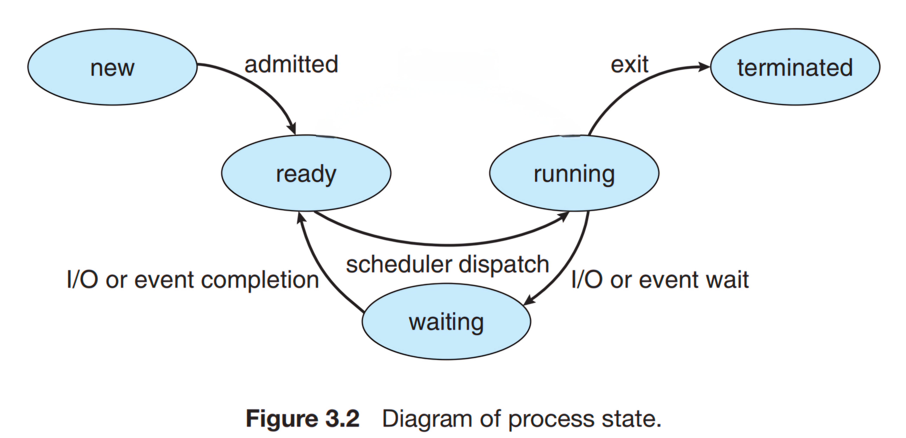
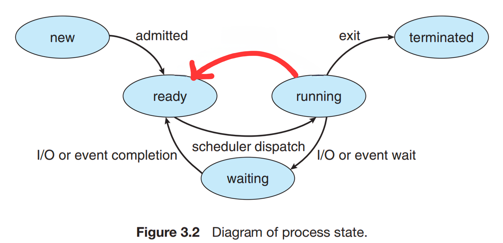

# EECS-3221E-SU-2024
 A repository of my assignments for EECS 3221E during the SU 2024 semester.

## Assignment 1

The goal of this assignment is to compare two methods of computation: mulitprocessing and multiprogramming.

In each program, we need to do the following:
- Create multiple processes / threads to accomplish the main computation
- For each process / thread, find the max and min values of the dataset it parses
- For each process / thread, compute the sum and difference of the max and min values of the dataset it parses
- Print out the name of the dataset, along with the min, max, sum and difference values
- Print out the overall max and min values between all of the datasets
- Use unix pipes to pass information from processes / threads to the main thread of execution

Using process.c, we accomplish these goals using multiprocessing.  We have a parent process, which creates multiple children.  We create these children using the fork() system call, which creates a child process that continues execution on the line after it's creation.  fork() returns 0 to the child process, and the PID to the parent process.  

Using thread.c, we accomplish these goals using multithreading.  We have the main process, which creates multiple threads.

Each child / thread is assigned its own dataset.  The number of children / threads created depends on the number of datasets specified in the terminal.

Once the children / threads complete their execution, they upload their information through a unix pipe, which the main process will collect.  From here, the main process will print out this information, and use it to determine the overall minimum and maximum values.

## Assignment Project

The assignment project for this course deals with the concepts of CPU scheduling algorithms.  This project is divided into 2 parts: Part 1, FCFS, and Part 2, RR and FBQ.  

We create a simulated CPU, which allows us to design our simulated scheduling algorithms on the processor.  The simulation uses an integer counter (I designated as clk, short for clock) to track the current instruction cycle.  Each cycle, a CPU will complete 1 instruction from the CPU burst of a process.  In this simulation, we have 4 homogenous CPUs to allow for parallel execution.  This means, at any given clock cycle, we can have up to 4 processes scheduled and executing a CPU burst at a time.

I/O bursts are handled similarly.  Once a process finishes it's CPU burst, it goes to complete an I/O burst.  This means that a process is waiting for some I/O event or data to complete.  Once a process has finished it's I/O burst, it can be scheduled for execution and placed back in the ready queue.

In terms of queues and arrays, we have several.  
- New Array
- Ready Queue
- Waiting Queue
- Execute Queue (AKA Running)
- Temporary Queue
- Temporary Array
- Finish Array (AKA Terminated)

The first is an array of all the processes, which we use to track when a process arrives.  This array is ordered by arrival time (lowest to highest) and can be considered the "new" queue.  We also have another array that tracks the order of processes that finish, by adding them to the array upon completing all of their bursts.  These processes are removed from circulation.

We then have the 3 circulation queues; ready, wait and running / executing.  These contain active processes.  The ready queue contains processes that are ready for execution.  The wait queue contains processes that are blocked by an I/O burst.  Execute / Run contains processes that are currently executing on the simulated CPUs.  Since the number of CPUs is 4 (each uni-core), this queue can only have a maximum size of 4.

Finally, the temporary queue and array are used to store and order processes as they transition to a "ready" state.  Removing a level of abstraction to talk more about the code implementation, I had a tempReady queue to enqueue processes in when they complete their I/O bursts.  The tempArr is used to sort these transitioned processes by using C's built in qsort function.  I then use this to reference the PIDs in the tempReady queue, to then enqueue these processes in that order into the ready queue and dequeue them from the tempReady queue.

At the end of the simulation, we're asked to report statistics of the simulation.  The statistics include the following data:
- Average wait time of all processes
- Average turnaround time of all processes
- Final simulation time that all processes completed
- Average CPU uilization (100% for each CPU, 400% at any given clock cycle if all 4 CPUs are being used)
- Number of context switches (only for preemptive switching)
- PID(s) of the last process(es) to finish

The simulated processes and their data are provided in a file called CPULoad.dat.  This file contains the information in a specific format:
    PID   Arrival_Time   CPU Burst 1   (I/O Burst 1)   CPU Burst 2   (I/O Burst 2) ...
    e.g. 0 0 4 (100) 12 (27) 2 ...

The given files sch-helpers.c and sch-helpers.h are used to provide helpful functions and structures for us to develop our assignment on.  These include functions to help read and parse data from CPULoad.dat, initialize structs with this data, compare process attributes and basic queue elements (initialization, enqueue, dequeue).  I even modified and added some of my own functions to enhance these features (remove an element from any part of the queue, compare processes by PID if they arrive at the same time, etc.).

Due to the complexity of designing a simulated CPU and scheduling algorithms, this project was broken into two parts, spanning an entire month.

### Assignment Project Part 1

In the first part of the assignment project, we were tasked with designing a CPU simulation with the FCFS (First-Come First-Served) scheduling
algorithm.  Using FCFS, we schedule processes in order of arrival.  The processes that arrive first get serviced first.  If two processes arrive at the same time, the process with the lower PID (Process ID) comes first.  This scheduling is non-preemptive, meaning we do not switch out the process intentionally until it is interrupted by I/O (finishing it's current CPU burst).

### Assignment Project Part 2

In the second part of the assignment project, we now needed to implement two more scheduling algorithms based on our first simulation: RR (Round-Robin) and FBQ (Feedback Queue).  

RR scheduling is similar to FCFS, but we have a preemption component.  Just like FCFS, we schedule processes in order of arrival.  However, each process can only run for a limited time before being swapped out for another process.  This time slice is designated by value called the "time quantum".  

The time quantum of RR can vary depending on what the developer specifies, and this leads to varying behaviour.  A smaller quantum means processes execute shorter bursts and are switched out more often.  Larger quantums allow processes to run longer.  By increasing the quantum to be greater or equal to the length of the longest CPU burst (if we know ahead of time), RR actually performs exactly like FCFS.  If a process exceeds it's time quantum, another process is preempted from the ready queue and the current process is placed at the back of the ready queue.  This kind of preemption targets fairness, to ensure each process runs for an equal amount of time.  The ideal quantum length is set so that 80% of the processes can complete their bursts within the time quantum.  

For this assignment, we were asked to use 3 different time quantums for RR: 3, 10 and 45.  The quantum was specified in the args when running the program (./rr quantum < CPULoad.dat).

FBQ is an implementation of a multi-level feedback queue.  What makes this scheduling algorithm unique are the multiple queues implemented, each with their own scheduling algorithm.  Multi-level feedback queues have the following parameters:
- Multiple queues / tiers
- A scheduling algoritm for each queue
- Promotion and demotion criteria for a process
- The higher level queue must be empty before we can service a lower level queue 
    - (either by moving processes down, completing them or they transition to waiting)

A process can be demoted or promoted based on specific criteria.  In the context of this assignment, we promote a process to the top queue when it completes an I/O burst.  We demote a process if it exceeds it's time quantum.

For the assignment, we're asked to implement FBQ as a 3-level feedback queue.  The top queue will be scheduled using RR with a time quantum of 8.  The middle queue is also under RR scheduling, but with a time quantum of 20.  If a process exceeds both of these quantums, it is demoted to the bottom queue, which is scheduled under FCFS.

Since there are multiple tiers, I designed multiple copies of the ready queue, each to track a different tier level.  This way, we can check which queue to service depending on the size of the ready queue.  For example, if the top queue has a size 0, we can try to service the middle queue next.

FBQ incorperates elements from both RR and FCFS (since the queues are scheduled with these algorithms), so it was important to ensure each of the components were working correctly on their own (FCFS and RR).

## Assignment 2

The final assignment in this course focuses on synchronization and deadlock prevention.  In this assignment, our goal is to take an input file and reproduce a copy of its contents to an output file.  We also log all transactions to a log file (more on this later).  We copy the file byte by byte, using multiple producer and consumer threads.  The producer (IN) threads are responsible for taking a byte of data from the input file and adding them to the global ring buffer.  This ring buffer is shared across the process, so the data is available to both producers and consumers.  Consumers, on the other hand, take a chunk of this buffer data from the ring buffer and writes it to the output file.  Since there can be multiple IN and OUT threads running asynchronously, we need to ensure synchronization over critical sections of the code.  More on critical sections later.  This also means that data can be added to the buffer out of order.  Instead of adding data by arrival to the ring buffer, we add it to the file in it's specific place by finding the offset of the byte from the beginning of the file, and using it when writing the byte to the output file.  This way, all the data stays in its original position, even when being copied out of order.

To make the environment more randomized, we implement a function that uses nanosleep (nanos).  This function picks a random value between 0 and 0.01s to have the thread sleep for, before continuing.  These nanosleep functions are placed in between the different blocks of code t increase the randomization and volatility of the environment, better simulating a real life example.

The critical section of a program is a region of code that is executed by multiple concurrent threads of execution, which access shared resources.  Having multiple threads access a shared resource at the same time can lead to undefined behaviour.  For example, two threads writing a string to a file may try to access the file at the same time.  This means the current cursor index when both threads access the file is at the same place.  When they try to write the strings at the same time, their strings may be broken up by trying to write to the file at the same time.  In our case, the code has four regions that can be considered critical sections.  They are denoted as:
- read_byte
- write_byte
- produce
- consume

Note that produce and consume are different from producer and consumer thread functions, which instead encapsulate these four critical sections of code (producer contains read_byte, then produce, consumer contains consume, then write_byte).  The flow of data is as follows:
- Producer: read_byte from original file
- Producer: produce the byte of data as an element in the ring buffer
- Consumer: consume the byte of data from the ring buffer by copying it
- Consumer: write_byte to the output file

These four sections of code are considered critical since they access shared resources.  Since all actions must be logged (reading, writing, consuming and producing), any time a thread wants to do such, they need to log the behaviour.  These logs capture any transactions that occur in the critical sections of the code.  Therefore, there are four kinds of logs we expect to see: read_byte, write_byte, produce and consume.  This log file is universal and shared between all threads.  This means that for any of the above four sections (since those transactions need to be logged), they are considered critical, since they all deal with the same shared resource.  To manage this critical resource, we make use of a mutex lock.  After initializing the lock, we have all the threads try to acquire the lock (pthread_mutex_lock).  Once the lock is acquired, the thread can now enter the critical section that deals with the logfile.  After completing its task and writing to the log file, we release the lock (pthread_mutex_unlock) so that another thread can enter their critical section.

In addition to this critical section, we also have a critical section that deals with produce and consume.  The methods produce and consume write and read to a shared resource known as a ring buffer.  The producer writes byte data to the ring buffer, while the consumer reads data from the ring buffer.  Writing and reading are implemented using two pointers: the read pointer and the write pointer.  When we add a new element to the buffer, we increment the write pointer by 1.  When we read an element from the ring buffer, we increment the read pointer by 1 as well.  The difference between the write pointer and the read pointer is the current size of unread elements left in the buffer.  In terms of the critical section here, we start with an empty buffer.  We use two semaphores, emp to denote the number of empty indexes and full to denote the number of used indexes.  When the producer adds an element to the buffer, it signals full (sem_post) to indicate that an element has been added to the buffer.  Similarly, when an element is extracted from the buffer by the consumer, it signals emp (sem_post) to increment the semaphore and update the number of empty indexes.  Before the threads can enter their respecive critical sections, they must wait (sem_wait or sem_trywait) until the semaphore > 0.  Waiting decrements the semaphore, while signaling increments.  In this way, producers and consumers can synchronize adding and removing elements from the ring buffer with mutual exclusion. 

I was also able to tackle the advanced solution for this assignment.  The basic solution requires us to wait for an unspecified amount of time, to assume all threads have finished executing.  As you can imagine, this does not guarantee all threads terminate before the time is up.  The advanced solution requires us to determine when all threads terminate.  For the producers, this is simple, once they reach the EOF, there are no more bytes to produce, so we can terminate them.  The consumers are a bit tricker, however.  The hint given to us in the assignment 2 slides mentions that we can terminate all consumer threads once all consumer threads are waiting on a semaphore.  While this may be true for multiple IN and OUT threads, it does not hold true for the base case, where you have 1 OUT thread.  That one thread will wait until full is signaled, but since there is only 1 OUT thread, and we have the maximum number of OUT threads waiting on full (just 1), we would hit this condition.  So I decided to add a few more conditions to ensure we have reached the end of the program.  One idea is to also check whether all the producer threads have terminated.  If all the produer threads have terminated and all consumer threads are waiting on the full semaphore to be signaled, we must have finished copying all from the file and buffer.  To implement this, I needed to use a sem_trywait instead of a sem_wait to keep checking whether this condition has been met while it waits for the full semaphore to be signaled, ensuring we do not enter a loop that runs forever.